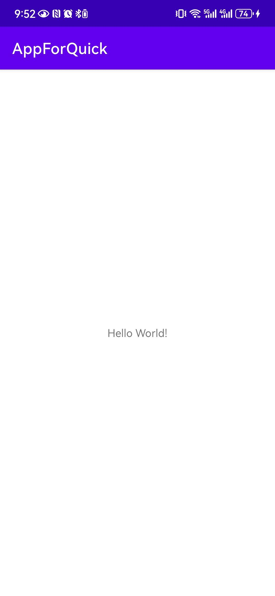
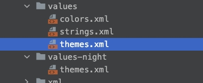

# 快速进行 Android 开发的工程

## 环境

- gradle-7.5
- Android Studio Android Studio Electric Eel
- targetSdk and compileSdk 33

2024-06

## 初始状态




## 设置基础主题: 去掉标题栏

在 themes.xml 文档中对 App 主题进行修改, 工程默认有日夜间配置, 两个文件都做修改



```xml
  <style name="Theme.AppForQuick" parent="Theme.MaterialComponents.DayNight.NoActionBar">
```

备注: 通过主题隐藏 ActionBar 在测试机型是生效的. 但是通过 ` <item name="android:windowFullscreen">true</item>`等方式设置全屏模式, 测试发现在 HuaWei 手机不生效, pixel 手机生效.

## 隐藏状态栏 StatusBar

为了更好的扩展能力, 状态栏默认为隐藏, 考虑到不同机型的兼容性, 使用代码实现此功能

```kotlin
   /**
     * 隐藏状态栏
     * StatusBar 设置为透明背景, 并且 DecorView 会向上填充 StatusBar 位置
     */
    fun hideStatusBar(activity: Activity?) {
        activity?.window?.apply {
            addFlags(WindowManager.LayoutParams.FLAG_DRAWS_SYSTEM_BAR_BACKGROUNDS)
            clearFlags(WindowManager.LayoutParams.FLAG_TRANSLUCENT_STATUS)
            addFlags(WindowManager.LayoutParams.FLAG_TRANSLUCENT_NAVIGATION)
            statusBarColor = Color.TRANSPARENT
        }
    }
```


## 兼容隐藏状态栏

StatusBar 隐藏后, DecorView 默认会向上填充, 这会引起 UI 异常, 可以采用如下方法解决

1. 针对高度设置为 `wrap_content` 或者 `match_parent` 的 View, 可以通过 `android:fitsSystemWindows="true"` 来完成

2. 针对固定高度的 View, 可以转化为第一种方案(多包裹一层 View)来解决, 也可以通过代码动态修改 View 的高度和 PaddingTop


